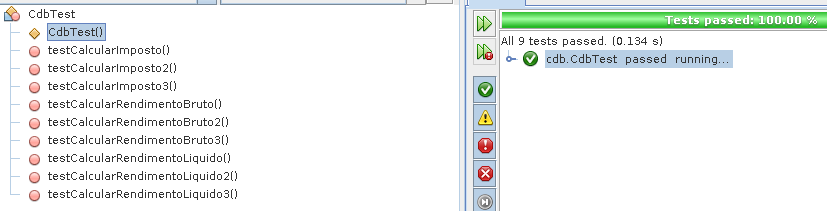

# 2020-2 Grupo1 TDD
## Técnicas utilizadas
### Falsificação
É uma técnica que consiste em fazer a unidade testada ter um valor de retorno ou comportamento fixo, o que permitira a construção de um caso de teste único que vai passar, esperando exatamente esse valor ou comportamento fixado. Claro, isso significa que nesse momento a unidade não está de fato implementada, mas obter o sucesso no teste diminui a ansiedade psicológica dos testadores. E podem ajudar o planejamento da solução completa, cuja implementação pode ainda não estar clara.

### Triangulação
É uma técnica que busca melhorar as chances de garantir que a funcionalidade funciona como desejado. Para tal a ideia é ter mais casos de teste diferentes que testam a mesma funcionalidade, cada um passando um conjunto de parâmetros diferentes ou em situações diferentes. Se todos os casos passam, há uma maior garantia de que as possibilidades diferentes estão sendo cobertas, principalmente se combinada com técnicas como análise de valor limite e particionamento de equivalência.

## Análise Crítica
A maior dificuldade encontrada foi definir quais casos testar para contemplar a triangulação. Isso porque é importante definir casos que vão testar possibilidades realmente diferentes e casos especiais. Por isso o uso do particionamento de equivalência e análise de valor limite. Fora isso não houveram maiores dificuldades, as técnicas e o TDD de forma geral ajudam bastante a enxergar melhor como planejar as funcionalidades e garantir seu correto funcionamento.

## Resultados

